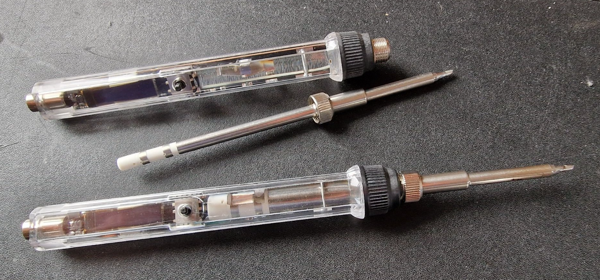
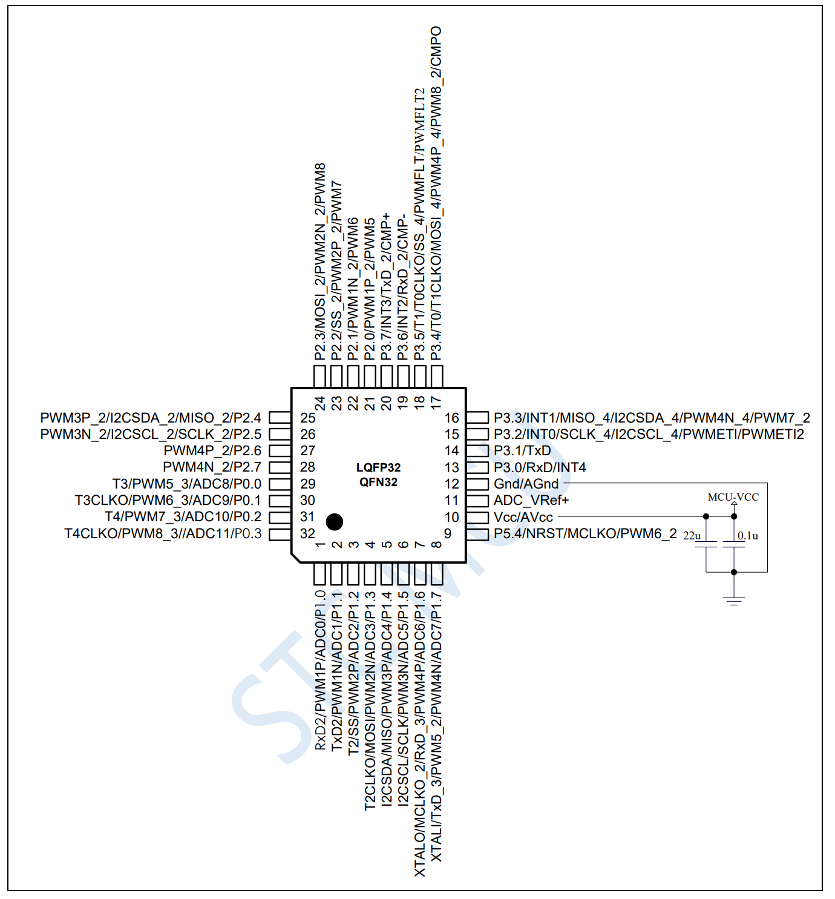

# ATC_stc_solder_iron
Custom firmware for cheap STC Based Soldering iron using PlatformIO and SDCC 8051 based

Tested and used in Visual Studio Code and PlatformIO

The Iron does use this 8051 core soc:
STC8H3K64S2 

Here is a YouTube video that shows the general function
https://youtu.be/mId_FW86pwQ

Soldering iron:

Pinout STC SoC:

